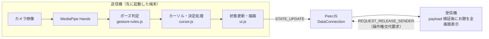

# Gesture Show!

カメラに映した手のジェスチャーで操作する、ジェスチャーゲーム（身振りでお題を当てる遊び）用の回答表示ボードです。ブラウザだけで動く静的 Web アプリで、2 台の端末を P2P（サーバーを介さない端末同士の直接通信）で同期させて使います。

🎮 公開ページ: https://otonasi-muonn.github.io/GESTURE/

## 概要

このアプリは、回答者が手元の端末（送信機）でお題を選ぶと、もう 1 台の端末（受信機）に選択中のお題が大きく表示される仕組みでこの課題を解決します。

送信機の操作はカメラに映した手のジェスチャーで行えるため、ゲームの進行中に端末へ触れる必要がありません。カメラが使えない環境でも、マウス／タッチで同じ操作ができます。

設計上の価値軸は「操作の少なさ」「1 画面内での状態把握」「同期の自己回復」です（`docs/20260719_gesture_brushup_audit.md`）。

## メイン機能

- **ハンドトラッキング操作** — カメラ映像から MediaPipe Hands で手（最大 2 つ）を検出し、手のひら中心（中指付け根のランドマーク）に追従するカーソルで画面を操作します。カーソル位置は線形補間（Lerp）でなめらかに動き、検出した手の骨格はネオン調の線で画面に重ねて描画されます。
- **ジェスチャーによる決定と戻る** — グー（人差し指〜小指をすべて折る）でカーソル下の対象を 1 回だけ選択し、チョキ（人差し指と中指だけを伸ばす）でお題画面からカテゴリー選択へ戻ります。誤検出による連打や二重遷移を防ぐため、決定・戻るとも内部でラッチ（一度発火したら解除まで再発火しない仕組み）とクールダウンを持ちます。
- **お題の単一選択** — 10 カテゴリ・各 33〜46 語、合計約 420 語のお題を収録しています。お題はラジオボタンと同じ単一選択で、別のお題を選ぶと前の選択は自動で外れます。リセットボタンで選択を解除できます。
- **2 端末の P2P 同期** — 先に起動した端末が固定 ID を取得して送信機になり、後から開いた端末は受信機として接続します。送信機の画面・カテゴリ・選択お題が受信機へ即時配信され、受信機は選択中のお題 1 件を全画面で表示します。受信機の「操作権をとる」ボタンで役割を交代できます。
- **効果音の内蔵生成** — 音声ファイルを持たず、Web Audio API のオシレーターでホバー音・決定音・ブザー音などを合成します。ブラウザの自動再生制限に対応するため、「サウンド ON」ボタンで明示的に有効化する方式です。
- **カメラ背景の表示調整** — 背景に映るカメラ映像の透明度を「中 → 明 → OFF → 暗」の 4 段階で切り替えられます。

## 使い方

1. 送信機にする端末でアプリを開き、カメラ利用を許可します。最初に開いた端末が自動的に送信機になります。
2. 別の端末（またはタブ）でアプリを開くと、受信機として自動接続され、ヘッダーの同期バッジに役割が表示されます。
3. 送信機で手をカメラに映すとカーソルが表示されます。カーソルをカテゴリーに合わせてグーで決定します。
4. お題一覧から出題したい語をグーで選ぶと、受信機にそのお題が大きく表示されます。
5. チョキ、または画面左上の戻るボタンでカテゴリー選択に戻ります。「このカテゴリーをリセット」で選択を解除できます。
6. 受信機側で操作したくなったら「操作権をとる」を押すと、送信機と受信機が入れ替わります。

すべての操作はマウス／タッチでも行えるため、カメラなしでも動作確認ができます。

## 技術スタック

| 分類 | 技術 | 用途 |
| --- | --- | --- |
| 言語 | HTML / CSS / JavaScript（ES Modules） | ビルドツールなしの静的構成 |
| 手検出 | MediaPipe Hands 0.4（CDN 読み込み） | カメラ映像からの手ランドマーク検出 |
| 通信 | PeerJS 1.4.7（CDN 読み込み） | WebRTC による端末間の P2P 同期 |
| 音声 | Web Audio API | 効果音のリアルタイム合成 |
| テスト | Node.js 標準テストランナー（`node:test`） | ロジックの回帰テスト |
| インフラ | GitHub Actions + GitHub Pages | main/master への push で自動デプロイ |
| 開発ツール | `python -m http.server` | ローカル確認用の静的サーバー |

npm 依存はなく、外部ライブラリはすべて CDN から読み込みます。

## 技術選定の理由

- **ビルドなしの静的構成** — `index.html` を静的サーバーで配信するだけで動くため、GitHub Pages にそのままデプロイでき、環境構築も HTTP サーバー 1 つで済みます。
- **固定 ID による PeerJS 同期** — ルームコードの入力や中継サーバーの運用をせずに 2 端末をつなぐため、固定 ID `gesture-game-master-sender` の取得競争で送信機／受信機を自動判定する方式を採っています（`docs/tasks` の制約として「ルームコード・新規外部依存を追加しない」ことが明記されています）。
- **Web Audio API による効果音生成** — 音声ファイルというアセットを持たずに済み、静的構成を保てます。

## 技術的な見どころ

### 1. 固定 ID の取得競争による役割決定と操作権交代（`src/sync.js`）

シグナリングサーバー以外のサーバーを持たずに「どちらの端末が操作側か」を決める必要があります。全端末がまず固定 ID で Peer 登録を試み、成功した端末が送信機、`unavailable-id` エラーになった端末が受信機になる、という取得競争で役割を自動決定します。受信機が「操作権をとる」を押すと、送信機へ `REQUEST_RELEASE_SENDER` を送って ID を手放させ、自分が固定 ID の取得を最大 3 回リトライします。取得できなければ受信機へ安全に降格するため、交代に失敗しても操作不能にはなりません。切断・エラー時の再起動タイマーは 1 本に集約し、再初期化の前に必ず旧 Peer・接続・タイマーを破棄することで、非同期イベントが交錯しても古い接続が残らないようにしています。

### 2. 誤発火を防ぐジェスチャーのラッチ設計（`src/gesture-rules.js`, `src/cursor.js`）

カメラ検出は毎フレーム揺らぐため、素朴に「ポーズ中は毎フレーム発火」とすると連打や二重遷移が起きます。ポーズ判定は「指先が第 2 関節より手首から遠いか」という距離比較だけで指ごとの伸展を判定するシンプルな純関数にし、その上に用途別の発火制御を重ねています。決定（グー）は「1 回握るごとに 1 クリック」で、発火後はラッチし、250ms 以上手が開いた状態が続いたときだけ再武装します。戻る（チョキ）は成立エッジ（不成立→成立の瞬間）でのみ発火し、両手のどちらかがポーズを維持している間はラッチを保持します。さらに送信機の GAME 画面でのみ画面遷移を実行するため、受信機や HOME でポーズしても誤動作しません。判定ロジックが DOM に依存しない純関数なので、Node の標準テストランナーだけでテストできます。

### 3. MediaPipe ライフサイクルの直列化（`src/gestures.js`）

操作権交代のたびにカメラと MediaPipe を起動・停止しますが、`camera.start()` が保留のまま停止要求が来る、停止中に次の起動要求が来る、といった競合が起こり得ます。そこで起動・停止をすべて 1 本の Promise チェーン（`mediaPipeLifecycleQueue`）に載せて直列実行し、各世代のオブジェクトに「現行世代か」「停止中か」のフラグを持たせています。開始が保留のまま停止された場合も、開始完了を待ってからカメラを止め直すため、MediaStreamTrack やカメラリソースのリークを防いでいます。起動失敗時はカメラ利用不可の表示に切り替え、マウス／タッチ操作へフォールバックします。

### 4. 受信機を「表示専用」に保つ二重のガード（`src/sync-rules.js`, `src/sync.js`）

送信機と受信機で状態が食い違うと、どちらの表示が正しいか分からなくなります。そこで状態変更の入口（カテゴリ選択・お題選択・リセット）にはすべて role ガードを置いて受信機からのローカル変更を遮断し、受信機の描画は送信機から届いた同期状態だけで更新します。さらに受信データは `parseStateUpdate` で検証し、画面名・カテゴリ ID・お題インデックスの整合性が取れた payload だけを反映するため、不正なデータが表示を壊しません。

## システム構成・処理の流れ



送信機ではカメラの毎フレームを MediaPipe Hands に渡し、検出結果からポーズを判定してカーソル移動・決定・戻るを処理します。状態が変わるたびに `STATE_UPDATE` を全受信機へ配信し、受信機は検証済みの状態だけを描画に反映します。

## 環境構築

必要なのは Python（標準ライブラリのみ）と、テストを実行する場合の Node.js です。npm install などのセットアップは不要です。

```bash
# 起動（プロジェクトルートで実行し、http://localhost:8000 を開く）
python -m http.server 8000
```

`file://` で直接開くとカメラ API や ES Modules の挙動がブラウザによって異なるため、localhost の静的サーバー経由で開いてください。初回アクセス時にカメラ利用を許可します。

2 タブでの同期確認手順は `CLAUDE.md` に記載されています。

```bash
# テスト（Node.js の標準テストランナーを使用。外部依存なし）
node --test tests/*.mjs
```

デプロイは `.github/workflows/deploy.yml` により、main / master ブランチへの push で GitHub Pages へ自動反映されます。

## ディレクトリ構成

```text
.
├── index.html        # 画面構造、MediaPipe / PeerJS の CDN 読み込み
├── app.js            # 起動処理、イベント配線、UI と同期の接続
├── style.css         # ネオン調 UI とレスポンシブレイアウト
├── src/
│   ├── state.js         # 共有状態と DOM 参照
│   ├── data.js          # 10 カテゴリのお題データ
│   ├── ui.js            # 画面描画、単一選択、画面遷移
│   ├── cursor.js        # カーソル補間、ホバー、決定入力
│   ├── gestures.js      # MediaPipe の起動・停止、骨格描画
│   ├── gesture-rules.js # 指ポーズ判定の純関数（テスト対象）
│   ├── sync.js          # PeerJS の役割判定、状態配信、操作権交代
│   ├── sync-rules.js    # role ガードなど同期ルールの純関数
│   └── audio.js         # Web Audio API による効果音生成
├── tests/            # node:test による回帰テスト
├── docs/             # 設計監査・入力仕様の ADR（設計判断の記録）
└── tasks/            # ブラッシュアップ作業の進行記録
```

## 今後の改善点

- **テスト・ドキュメントの追従** — 直近のコミットで決定ジェスチャーがグー、戻るがチョキ、カーソル基準点が手のひら中心（ランドマーク 9）へ変更されましたが、`tests/` の一部と `CLAUDE.md`・`docs/` は旧仕様（人差し指で決定、親指＋人差し指で戻る、指先カーソル）のままです。現時点で 38 件中 13 件のテストが失敗します。
- **固定 ID の割り切り** — 固定 ID は認証情報ではないため、ID を知っていれば誰でも接続と操作権交代の要求ができます。信頼できる参加者だけで使う前提の設計であり、公開ネットワークでの無人運用は想定していません。
- **Gesture Recognizer への移行** — `docs/` では、学習済みモデル（MediaPipe Gesture Recognizer）による判定への移行が将来候補として挙げられています。
